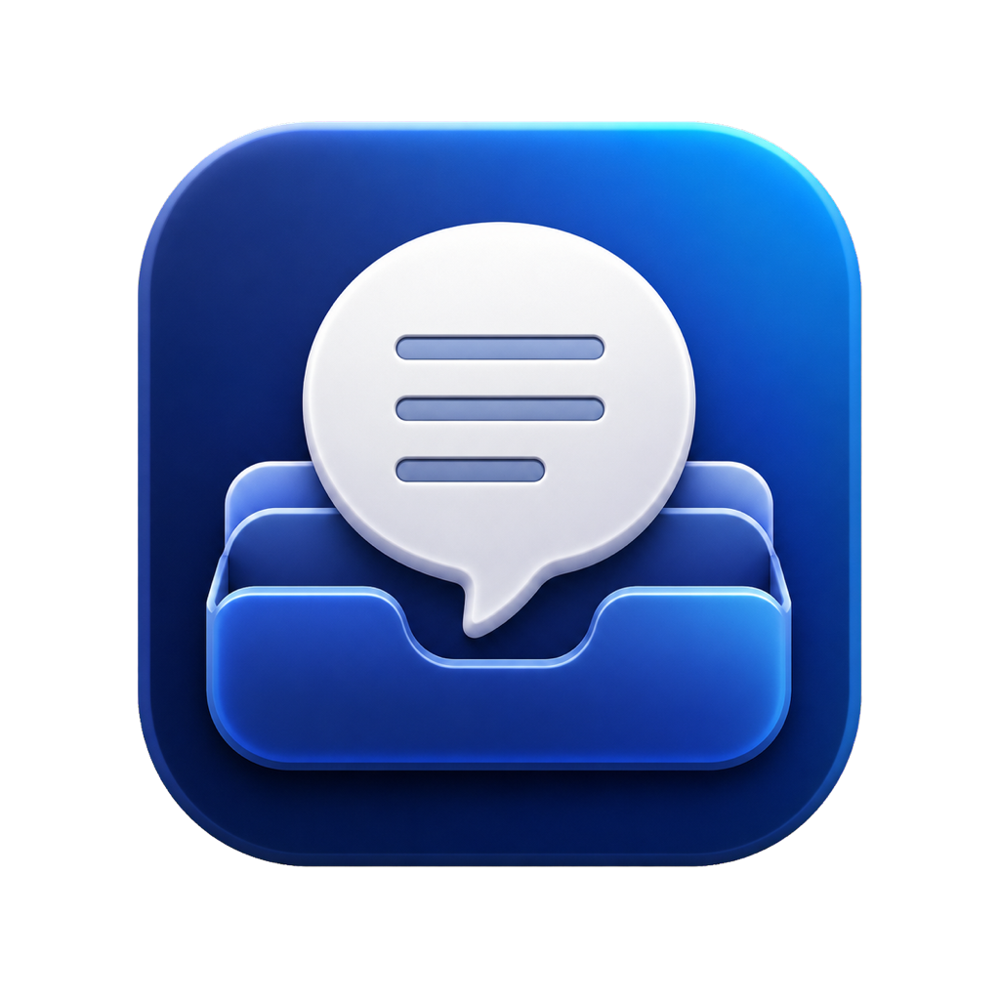

<p align="center">
  
</p>

<h1 align="center">PromptDock</h1>

<p align="center">
  把常用提示词整理好，在需要时立刻找到、填写并复制。<br>
  Organize the prompts you rely on. Find, fill, and copy them when you need them.
</p>

<p align="center">
  <a href="https://cuegroveapp.com/early-access"><strong>Early Access</strong></a>
  ·
  <a href="https://cuegroveapp.com">CueGrove</a>
  ·
  <a href="docs/ROADMAP.zh-CN.md">Roadmap</a>
</p>

<p align="center">
  <strong><a href="#简体中文">简体中文</a></strong>
  ·
  <strong><a href="#english">English</a></strong>
</p>

<p align="center">
  <a href="https://github.com/13304930782/PromptDock/actions/workflows/ci.yml?query=branch%3Amain"></a>
  
  
  <a href="LICENSE"></a>
</p>

---

<a id="简体中文"></a>

# 简体中文

## 你的提示词，不该散落在聊天记录里

PromptDock 是一款为 macOS 设计的原生提示词管理工具。它把提示词变成可搜索、可复用的个人资料库：平时安静地待在菜单栏，需要时用快捷键唤出，找到后直接复制。

它适合经常重复使用提示词的学生、教师、开发者、创作者，以及希望把 AI 工作流程整理清楚的人。

## 从整理到使用，只需要几步

### 集中管理

创建、编辑、收藏和排序提示词；用分类、标签和智能集合整理不同工作场景。自定义分类可以选择系统 Emoji，也可以使用仅保存在本机的图片。

### 快速找到

搜索标题、正文和分类，实时高亮关键词并显示命中数量。使用上下方向键切换结果，不需要在鼠标和键盘之间反复移动。

### 立即复制

从菜单栏打开快搜，或按默认快捷键 `⇧⌘P`。选择结果后按 `Return` 即可复制，完成后窗口自动关闭。

### 把提示词变成模板

固定内容只写一次，把每次变化的部分设为变量：

```text
请用 {{语气}} 总结 {{主题}}，并依次处理这些文件：{{文件名[]}}
```

- `{{主题}}`：复制时填写一个值。
- `{{文件名[]}}`：用加号添加任意数量的同类项目，单个变量最多 100 项。
- 同名变量只需填写一次，所有位置会同步替换。
- 填写过程中可以实时预览最终提示词。

### 找回以前的内容

PromptDock 会在保存修改时保留版本历史，可预览并恢复旧版本。JSON 备份支持合并导入和替换导入；替换前会先创建安全备份。

### 融入 macOS

- 菜单栏快搜与可自定义的全局快捷键
- 桌面 Widget 快速复制最近或收藏的提示词
- 登录时启动
- 简体中文与 English
- 浅色、深色和高对比度界面

## AI 是可选项，不是前提

PromptDock 本身不依赖 AI 服务也能完整使用。需要时，你可以让模板助手根据自然语言需求生成带变量的提示词模板。

- 支持 DeepSeek 和 OpenAI 兼容接口。
- Early Access 阶段使用你自己的 API Key。
- API Key 保存在 macOS 钥匙串中。
- 每次发送前都会明确确认。
- 只发送当前输入的需求和模板语法手册，不会发送已保存的提示词资料库、分类或本地图片。

## 本地优先

你的提示词、分类、标签、历史版本、图片和备份默认保存在这台 Mac。PromptDock 当前没有账号、广告、行为分析、跟踪或云同步。

只有你主动确认使用在线 AI 模板助手时，当前需求才会发送给所选服务商，并受该服务商的隐私条款约束。Time Machine、磁盘同步及其他系统备份行为由你的 macOS 设置决定。

## 当前状态

PromptDock 目前处于 Early Access，当前版本仅支持 **macOS 14 或更高版本**。

Windows、iPhone 和 iPad 版本仍在规划中；本仓库不会把尚未提供的平台能力描述成现有功能。

> 免费 Apple ID / Personal Team 可以用于本机开发和测试。公开分发所需的 Developer ID 签名、公证和 Mac App Store 发布仍需要 Apple Developer Program。未经公证的测试版在首次启动时可能触发 Gatekeeper 提示。

## 开发者快速开始

PromptDock 使用 SwiftUI、SwiftData、AppKit、WidgetKit 和系统 Keychain 构建，不依赖第三方运行时框架。

1. 克隆仓库并打开 `PromptDock.xcodeproj`。
2. 在 **TARGETS → PromptDock → Signing & Capabilities** 中选择你的 Team。
3. 为 **PromptDockWidget** 选择同一个 Team。
4. 选择 `PromptDock` Scheme 和 `My Mac`，按 `⌘R`。

App Group 会根据 `$(DEVELOPMENT_TEAM).PromptDock` 自动生成，无需修改 Swift 源码。

运行测试：

```bash
xcodebuild \
  -project PromptDock.xcodeproj \
  -scheme PromptDock \
  -configuration Debug \
  -destination 'platform=macOS' \
  -derivedDataPath /tmp/PromptDockTests \
  CODE_SIGNING_ALLOWED=NO \
  test
```

<details>
<summary><strong>仓库中的 CueGrove 网站</strong></summary>

本仓库同时包含独立的 CueGrove 官网与 Early Access 服务：

- `src/`：React、TypeScript、Vite 前端。
- `server/`：Express、MySQL、邮件和审核服务。
- `Brand/CueGrove/`：CueGrove 品牌资源。

网站开发使用 `pnpm dev`，后端使用 `pnpm server:dev`，生产构建使用 `pnpm build`。部署说明见 [CUEGROVE_DEPLOY.md](CUEGROVE_DEPLOY.md)。

</details>

<details>
<summary><strong>数据兼容与贡献说明</strong></summary>

SwiftData 模型使用显式 Schema 版本和迁移阶段。修改数据模型时，必须新增 Schema 版本与迁移测试，不能直接更改已发布的旧 Schema。

备份格式需保持向后兼容。涉及导入、迁移和 Widget 共享存储的修改，应同时验证失败回滚和旧数据读取。

安全问题请参阅 [SECURITY.md](SECURITY.md)，不要在公开 Issue 中提交 API Key、私人提示词或其他敏感数据。

</details>

## License

PromptDock 使用 [MIT License](LICENSE)。

<p align="right"><a href="#english">English →</a></p>

---

<a id="english"></a>

# English

## Your prompts should not be buried in chat history

PromptDock is a native prompt manager for macOS. It turns prompts into a searchable, reusable personal library: it stays quietly in the menu bar, opens with a shortcut when needed, and lets you copy the right prompt immediately.

It is designed for students, teachers, developers, creators, and anyone who wants a clearer, more dependable AI workflow.

## From organizing to using, in just a few steps

### Keep everything organized

Create, edit, favorite, and reorder prompts. Use categories, tags, and smart collections to organize different workflows. Custom categories can use a system Emoji or an image stored only on this Mac.

### Find the right prompt

Search titles, content, and categories with live keyword highlighting and match counts. Move through results with the arrow keys without constantly switching between mouse and keyboard.

### Copy immediately

Open Quick Search from the menu bar or press the default shortcut `⇧⌘P`. Select a result and press `Return` to copy it; the window closes automatically when copying is complete.

### Turn prompts into reusable templates

Write the fixed parts once and turn everything that changes into variables:

```text
Summarize {{topic}} in a {{tone}} tone, then process these files in order: {{filename[]}}
```

- `{{topic}}`: enter one value when copying.
- `{{filename[]}}`: use the plus button to add as many repeated items as needed, up to 100 items per variable.
- Variables with the same name are filled once and replaced everywhere.
- A live preview shows the final prompt while you fill it in.

### Recover earlier work

PromptDock saves version history whenever you save a change, so you can preview and restore an earlier version. JSON backups support merge and replace imports; a safety backup is created before replacement.

### Feel at home on macOS

- Menu bar Quick Search and a configurable global shortcut
- Desktop Widget for copying recent or favorite prompts
- Launch at login
- English and Simplified Chinese
- Light, dark, and high-contrast interfaces

## AI is optional, not required

PromptDock works fully without an AI service. When useful, the template assistant can turn a natural-language requirement into a prompt template with variables.

- Supports DeepSeek and OpenAI-compatible endpoints.
- Early Access uses your own API key.
- The API key is stored in the macOS Keychain.
- Every request requires your explicit confirmation.
- Only the current requirement and template syntax guide are sent. Your saved prompt library, categories, and local images are not included.

## Local first

Your prompts, categories, tags, version history, images, and backups stay on this Mac by default. PromptDock currently has no account system, advertising, behavioral analytics, tracking, or cloud sync.

Only when you explicitly confirm an online AI template request is the current requirement sent to the selected provider, subject to that provider's privacy terms. Time Machine, disk synchronization, and other system backup behavior depend on your macOS settings.

## Current status

PromptDock is currently in Early Access and supports **macOS 14 or later**.

Windows, iPhone, and iPad versions are still being planned. This repository does not present unavailable platform features as current functionality.

> A free Apple ID / Personal Team can be used for local development and testing. Public distribution with Developer ID signing, notarization, or the Mac App Store still requires the Apple Developer Program. An unnotarized test build may trigger a Gatekeeper warning on first launch.

## Developer quick start

PromptDock is built with SwiftUI, SwiftData, AppKit, WidgetKit, and the system Keychain, with no third-party runtime frameworks.

1. Clone the repository and open `PromptDock.xcodeproj`.
2. Under **TARGETS → PromptDock → Signing & Capabilities**, select your Team.
3. Select the same Team for **PromptDockWidget**.
4. Choose the `PromptDock` scheme and `My Mac`, then press `⌘R`.

The App Group is generated from `$(DEVELOPMENT_TEAM).PromptDock`, so no Swift source changes are required.

Run the tests:

```bash
xcodebuild \
  -project PromptDock.xcodeproj \
  -scheme PromptDock \
  -configuration Debug \
  -destination 'platform=macOS' \
  -derivedDataPath /tmp/PromptDockTests \
  CODE_SIGNING_ALLOWED=NO \
  test
```

<details>
<summary><strong>The CueGrove website in this repository</strong></summary>

This repository also contains the independent CueGrove website and Early Access service:

- `src/`: React, TypeScript, and Vite frontend.
- `server/`: Express, MySQL, email, and review services.
- `Brand/CueGrove/`: CueGrove brand assets.

Use `pnpm dev` for website development, `pnpm server:dev` for the backend, and `pnpm build` for a production build. See [CUEGROVE_DEPLOY.md](CUEGROVE_DEPLOY.md) for deployment instructions.

</details>

<details>
<summary><strong>Data compatibility and contributing</strong></summary>

The SwiftData model uses explicit schema versions and migration stages. Any data-model change must add a new schema version and migration tests instead of modifying a previously released schema.

Backup formats must remain backward compatible. Changes involving imports, migrations, or Widget shared storage should also verify rollback behavior and the ability to read existing data.

See [SECURITY.md](SECURITY.md) for security reporting. Do not submit API keys, private prompts, or other sensitive data in a public issue.

</details>

## License

PromptDock is available under the [MIT License](LICENSE).

<p align="right"><a href="#简体中文">← 简体中文</a></p>
